# ADB Helper 🦞

> **可视化 ADB 工作台** — 面向 Android 开发与测试人员的跨平台桌面工具

将所有 adb 命令组织为可视化工作流，覆盖 **13 个分类、200+ 条命令模板**，提供结构化结果渲染、设备 Capability 探测、多维筛选 Logcat、备份恢复、性能监控等一站式功能。

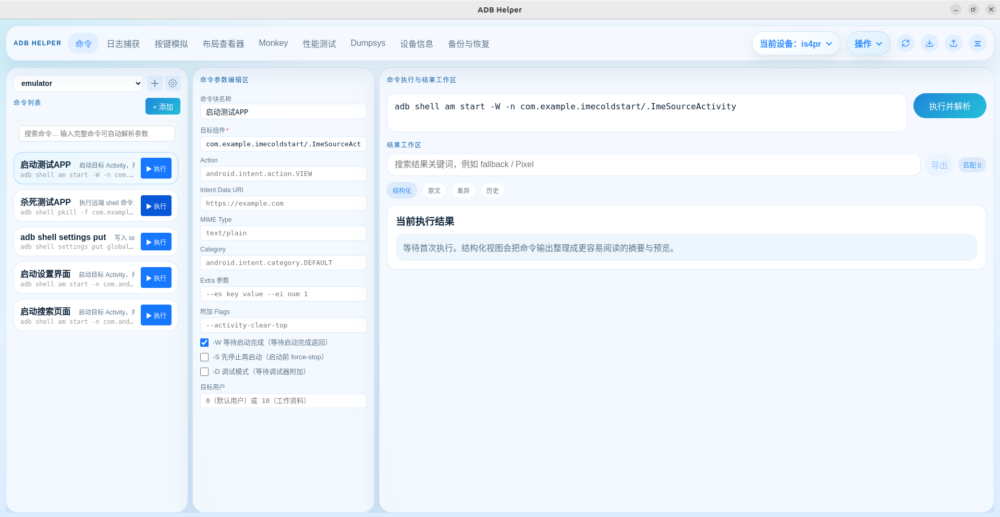

---

## 目录

- [快速开始](#快速开始)
- [功能总览](#功能总览)
  - [① 命令中心](#1-命令中心)
  - [② Logcat 日志捕获](#2-logcat-日志捕获)
  - [③ 按键模拟](#3-按键模拟)
  - [④ 布局查看器](#4-布局查看器)
  - [⑤ Monkey 测试](#5-monkey-测试)
  - [⑥ 性能测试](#6-性能测试)
  - [⑦ Dumpsys 诊断](#7-dumpsys-诊断)
  - [⑧ 设备信息](#8-设备信息)
  - [⑨ 备份与恢复](#9-备份与恢复)

---

## 快速开始

### 环境要求

| 项目 | 要求 |
|------|------|
| 操作系统 | Ubuntu 22.04+ / Windows 10+ / macOS 13+ |
| ADB | Android SDK Platform Tools（`adb` 需在 PATH 中） |
| Python | 3.10+ |
| Node.js | 18+（仅开发需要） |

### 启动

```bash
# 解压或进入已构建的目录
cd release/adb-helper-linux-x64
./adb-helper
```

首次启动会自动检测已连接的 adb 设备，界面左侧设备选择器会列出所有设备。

### 连接远程设备

在设备选择器的下拉菜单中点击 **操作 → 连接远程设备**，输入目标设备的 IP、端口和配对码即可。

---

## 功能总览

### ① 命令中心

ADB Helper 的核心页面，承载 **13 个分类、200+ 条 ADB 命令模板**。


**使用方式：**

1. 在左侧 **设备选择器** 中选择设备
2. 命令列表按分类折叠展示（adb 常用、am、pm、ime、content、wm、dumpsys、input 等）
3. 点击命令展开参数表单，填写参数后点击 **▶ 执行**
4. 结果区展示结构化输出 + 原始文本双视图

**筛选与搜索：**

- 顶部筛选栏：全部 / 查看型 / 写操作 / 高风险 / 已收藏
- 右侧搜索框：关键字实时搜索命令名称和描述
- 支持 **原始命令模式**：直接输入任意自定义 adb 命令

> 每条命令模板均标注了类型（查看/写操作）、风险等级（低/中/高）和设备支持度，高风险操作会触发二次确认。

---

### ② Logcat 日志捕获

实时流式捕获设备日志，支持多维度筛选和文件轮转。


**功能点：**

| 功能 | 说明 |
|------|------|
| 实时流式捕获 | 启动后持续接收设备日志，自动增量渲染 |
| 多维度筛选 | 按 Level（V/D/I/W/E/F）、搜索词、正则、Tag、PID、TID、包名过滤 |
| 进程名关联 | 自动通过 `ps` 映射 PID → 包名，日志行显示所属应用 |
| 规则组合 | 支持 AND/OR 多条件筛选规则，可添加多条规则 |
| 文件轮转 | 达到设定大小后自动分割文件 |
| 导出 | 一键导出为 ZIP 压缩包 |

**操作流程：**
- 选择设备 → 设置筛选条件 → 点击 **启动捕获**
- 运行中可随时修改筛选条件，无需停止
- 点击 **停止捕获** 结束会话并保存

#### 子标签：Crash/ANR 文件浏览

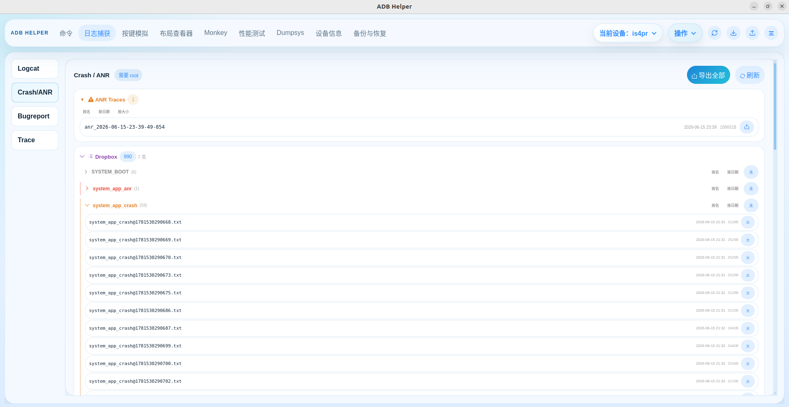

浏览和分析设备上的崩溃与 ANR 文件。

| 类别 | 来源 | 说明 |
|------|------|------|
| Tombstones | `/data/tombstones/` | Native 崩溃堆栈文件 |
| ANR 追踪 | `/data/anr/` | ANR 发生时系统自动生成的 traces |
| Dropbox | Dropbox Manager | 系统记录的各类崩溃事件 |

**操作：** 点击 **刷新** 从设备拉取文件列表 → 展开分类查看详情 → 选择一个文件查看内容 → 支持一键导出所选文件。

#### 子标签：Bugreport 生成

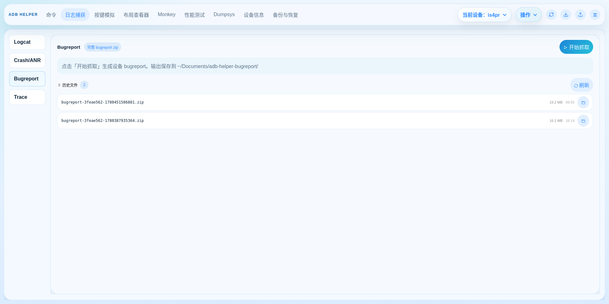

一键生成设备完整诊断报告。

- 执行 `adb bugreport` 收集完整设备诊断数据
- 自动保存到本地目录
- 支持管理已生成的 bugreport 文件（查看、重命名、删除）

#### 子标签：Trace 抓取

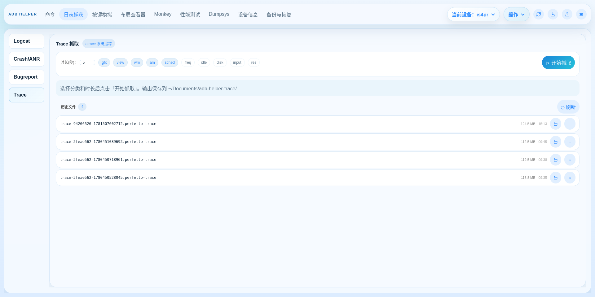

基于 **atrace** 的系统级性能追踪。

- **预设分组**：gfx（图形）、view（视图）、wm（窗口管理）、am（Activity 管理）、sched（调度）、freq（频率）、idle（空闲）、disk（磁盘）、input（输入）、res（资源）
- 支持自定义组合分组，精细化追踪目标
- 实时流式输出，使用 **atrace —async_stop** 优雅终止
- 追踪结果自动保存，可结合 Perfetto/Chrome://tracing 深入分析

---

### ③ 按键模拟

可视化模拟 Android 设备的按键、触摸和滑动操作。

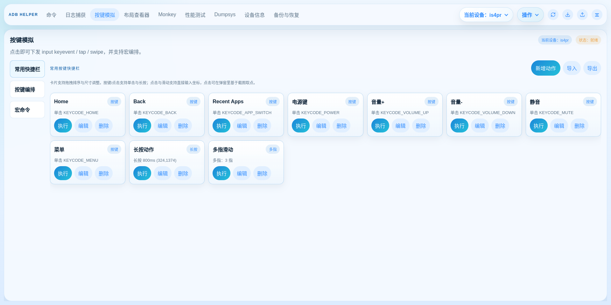

**两个子标签：**

**常用快捷栏：**
- 预置 Home、Back、Recent Apps、电源键、音量 +/-、静音、菜单等一键触发按钮
- 支持自定义按键类型（keyevent / tap / swipe / long_press / adb 命令）
- 可调整按钮大小（1×1 / 2×1 / 2×2）

**按键编排（宏任务）：**
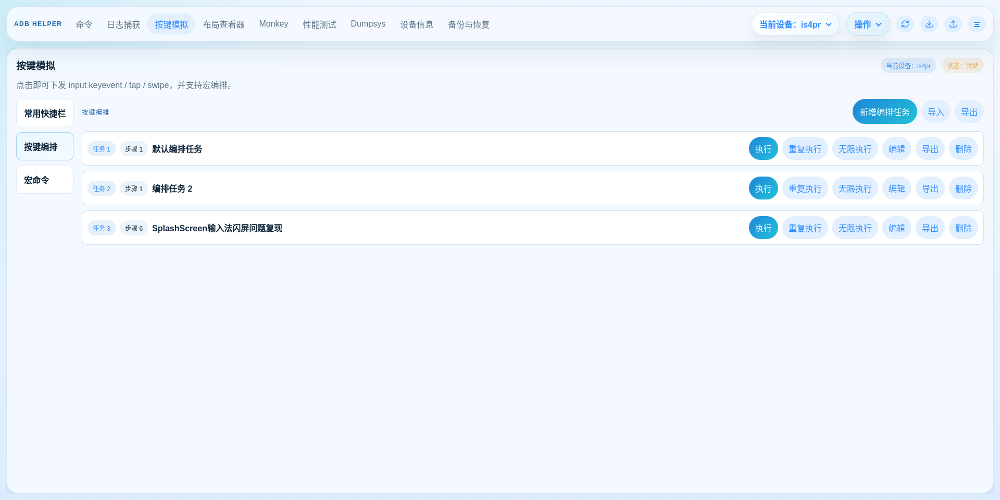

- 将多步操作（按键、点击、滑动、adb 命令）按时序组合
- 每步可独立设置延时间隔
- 保存为宏任务，一键回放

#### 宏命令录制与回放

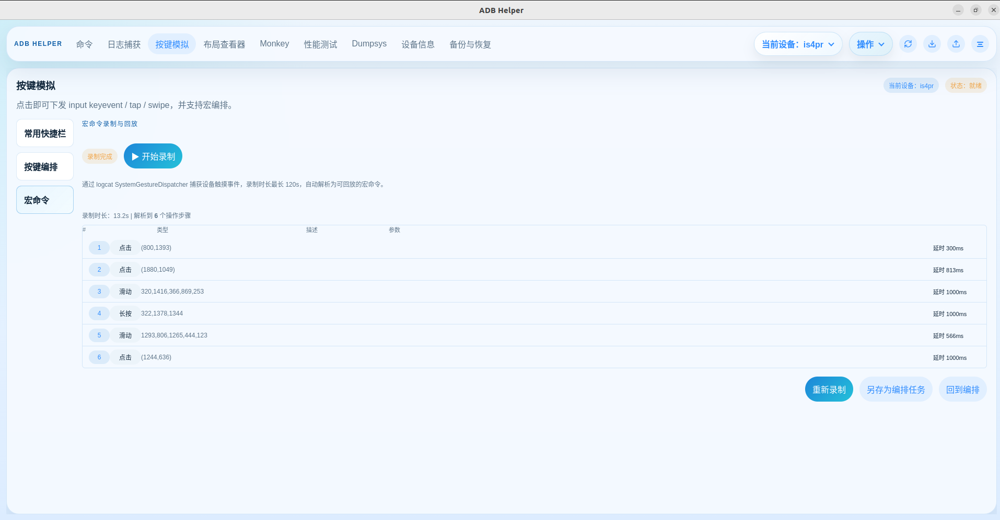

录制和管理的已保存宏命令列表。

- 基于按键编排创建的宏任务持久化存储
- 支持导入/导出宏命令（JSON 格式），方便团队共享
- 一键回放整个宏任务序列

#### 截图取点

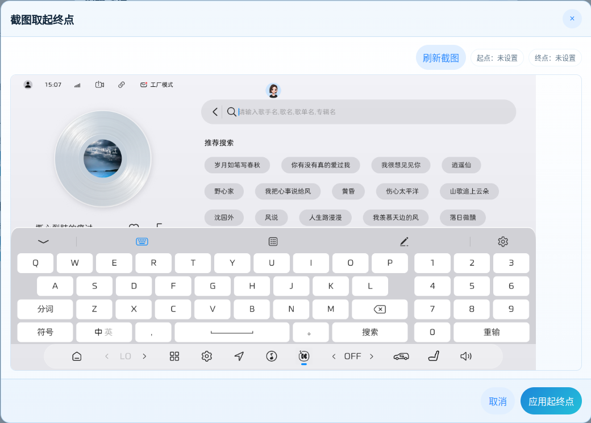

在编辑点击/滑动等动作时，支持**通过设备实时截图直接选取坐标点**：

1. 创建或编辑一个**点击（tap）或滑动（swipe）** 类型的快捷动作
2. 点击 **去实时截图取点** 按钮
3. 工具自动获取设备屏幕截图并展示
4. 在截图预览上点击目标位置 → 坐标自动填入参数
5. 支持在截图上可视化确认起点和终点

---

### ④ 布局查看器

集成了 **uiautomator dump** 和 **Winscope** 的 UI 层级分析工具。

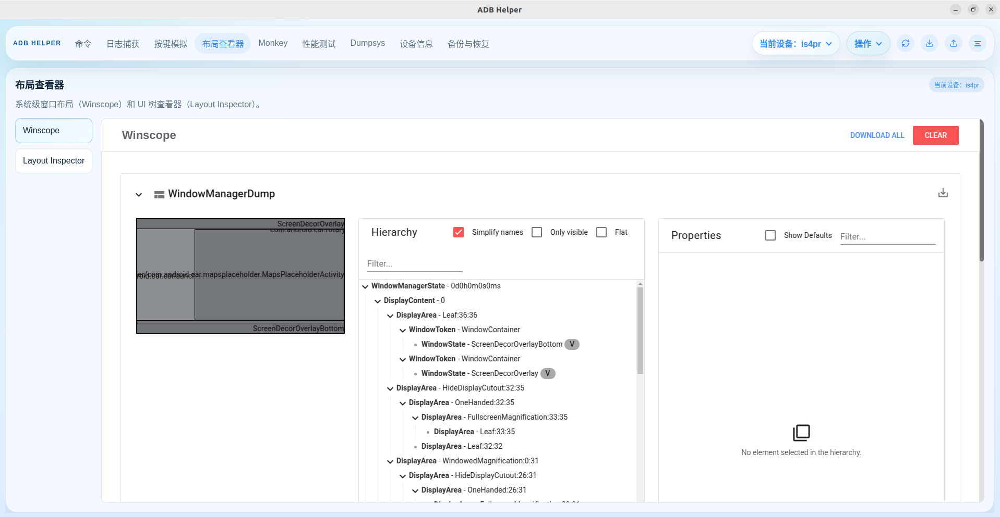

**功能：**

- **布局检查器**：dump 设备 UI 树 XML 并展示，支持节点展开/折叠
- **Winscope 集成**：深度分析 UI 层级、SurfaceFlinger 和窗口状态
- **设备截图**：一键获取设备屏幕截图
- **进程选择**：选择特定进程的 UI 布局进行分析
- **弹窗面板**：可将分析面板弹窗到独立窗口，双屏操作

---

### ⑤ Monkey 测试

可视化配置 Android Monkey 稳定性测试参数。

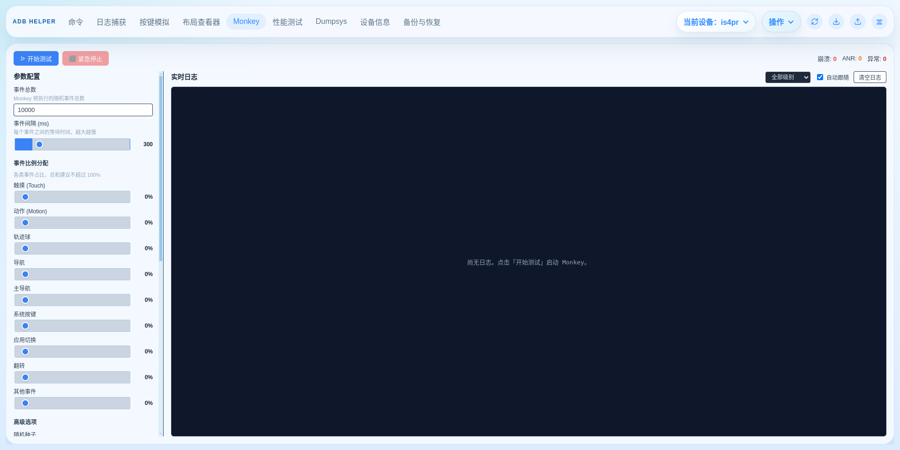

**可配置参数：**

| 参数 | 说明 |
|------|------|
| 目标包名 | 指定测试的应用 |
| 事件数量 | 总事件数（如 100000） |
| 各事件比例 | pct-touch / pct-motion / pct-nav / pct-trackball 等 |
| Throttle | 事件间延迟（ms） |
| Seed | 随机种子，方便复现 |
| 日志级别 | -v / -v -v 等 |

**功能：**
- 实时 logcat 异常高亮显示（ANR、Crash、Exception）
- 一键终止测试并清理进程
- 测试报告自动生成

---

### ⑥ 性能测试

对设备进行 CPU、内存、FPS 等指标的实时监控与应用启动耗时统计。

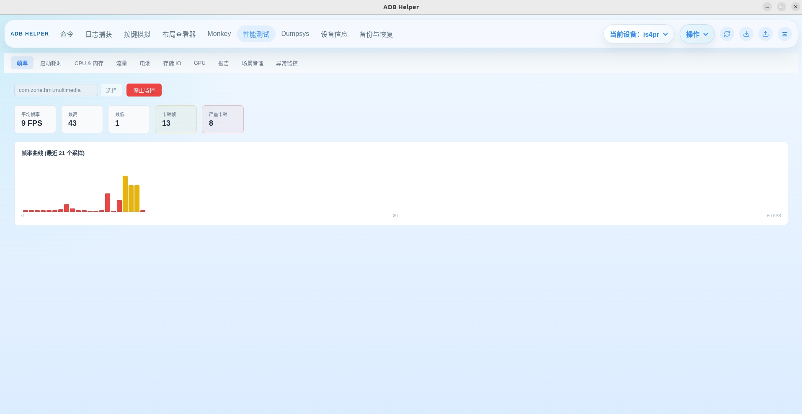

**功能点：**

- **实时折线图**：CPU 使用率、内存占用、FPS 实时曲线
- **电池监控**：电量百分比、充电状态、温度
- **应用启动耗时**：一键执行 `am start -W`，展示 ThisTime / TotalTime / WaitTime
- 支持冷启动和热启动性能对比

---

### ⑦ Dumpsys 诊断

200+ 个 dumpsys 服务一键查询，常用服务提供结构化解析输出。

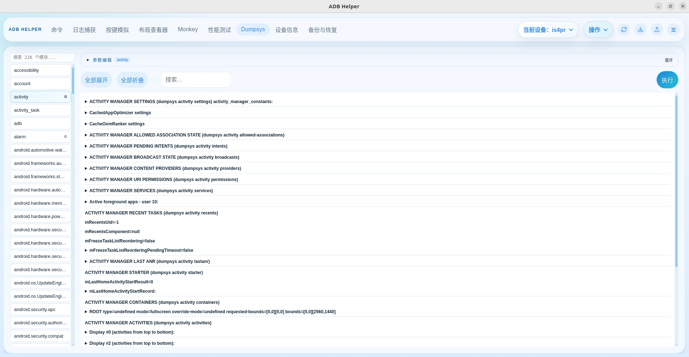

**预置常用服务标签页：**

| 标签 | 执行的命令 | 用途 |
|------|-----------|------|
| activity | `dumpsys activity` | Activity 栈、Task、进程 |
| window | `dumpsys window` | 窗口层级、焦点、Display |
| display | `dumpsys display` | 显示设备、Display 信息 |
| meminfo | `dumpsys meminfo` | 内存使用详情 |
| battery | `dumpsys battery` | 电池状态、充电信息 |
| SurfaceFlinger | `dumpsys SurfaceFlinger` | 图层合成信息 |
| input | `dumpsys input` | 输入设备、配置 |
| package | `dumpsys package` | 包管理详细数据 |

每个标签页的执行结果均支持 **结构化预览 + 原始文本双视图** 切换，以及关键字搜索高亮。

**Dumpsys 详情示例：**

<details>
<summary>点击展开 Dumpsys activity 截图</summary>


</details>

<details>
<summary>点击展开 Dumpsys battery 截图</summary>

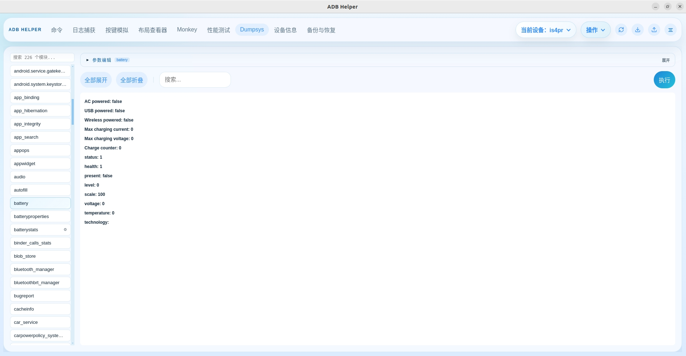

</details>

---

### ⑧ 设备信息

完整的设备探针和信息管理面板，包含 **7 个子标签页**。

**基础信息**
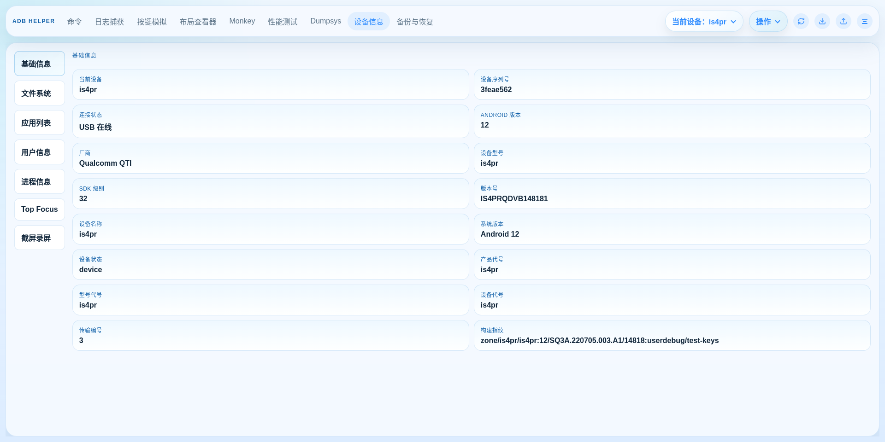
- 设备序列号、名称、连接状态
- Android 版本、SDK 级别、型号/品牌、Build Fingerprint
- 传输方式（USB / TCP/IP）

**文件系统**
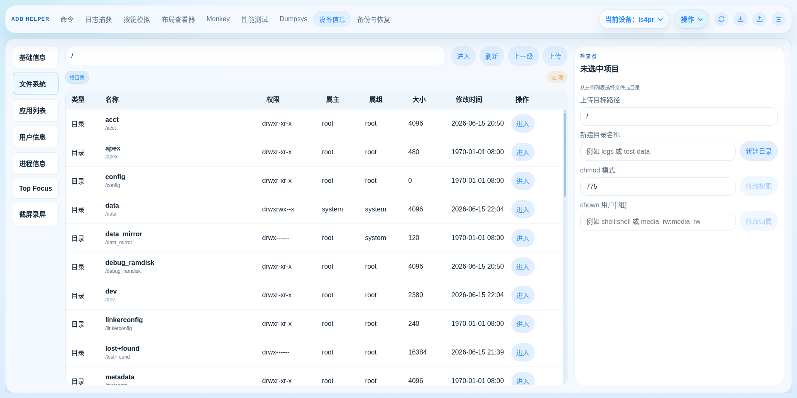
- 浏览设备目录结构
- 上传文件 / 下载文件 / 删除文件 / chmod 权限修改
- 自动识别目录和文件类型

**应用列表**
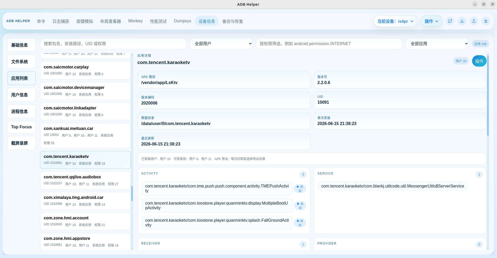
- 展示所有已安装应用（包名、UID、安装用户、系统/用户应用、权限数）
- 点击查看应用详情（Activity / Service / Receiver / Provider 组件明细）
- 支持快捷卸载、拉取 APK

**用户信息**
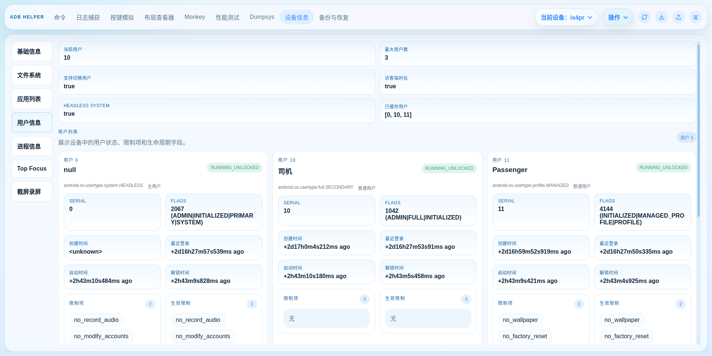
- 用户列表（ID、名称、类型、状态、创建/登录时间）
- 用户上限、Guest 限制、Headless System Mode 状态
- CarService Passenger 配置展示（多屏多用户场景，INGO 项目定制）

**进程信息**
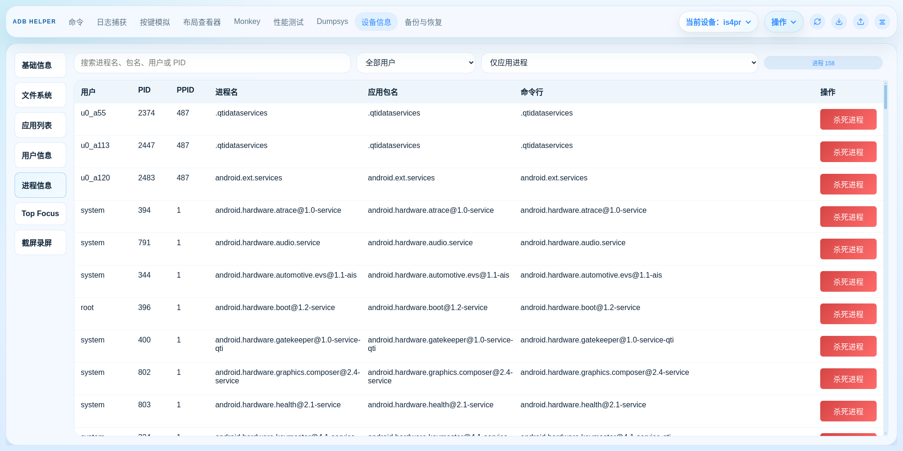
- 全量进程列表（User / PID / PPID / 进程名 / 参数 / 归属包名）
- 区分内核线程和应用进程
- 支持搜索过滤和一键杀死进程

**截屏录屏**
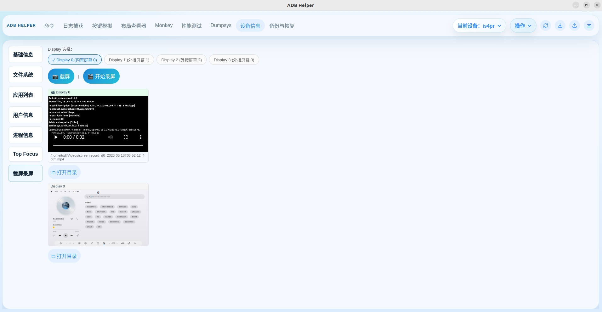
- 一键设备截图（支持多 Display 选择）
- 设备录屏（MP4 格式）
- 截图自动保存到本地目录

**Top Focus 查询**
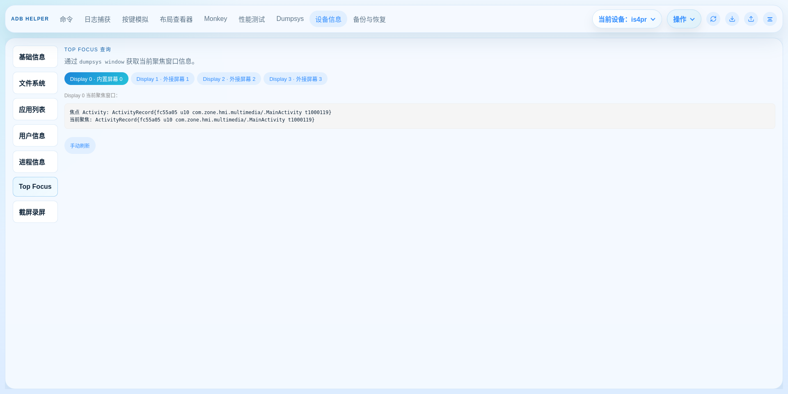

获取当前设备指定 Display 或 TDA（Task Display Area）的 Top Focus 窗口信息。

- 输入目标 **Display ID**（默认 0）或 **TDA ID** 查询
- 结果展示焦点所在窗口的包名、类名、Token、Task Fragment 等关键信息
- 适用于多屏多用户场景（如 INGO 项目 CarService Passenger）下快速定位某块屏幕的前台应用
- 结合多 Display 架构排查焦点转移异常或窗口层级问题

---

### ⑨ 备份与恢复

设备系统分区备份工具，专门针对 INGO 项目定制。

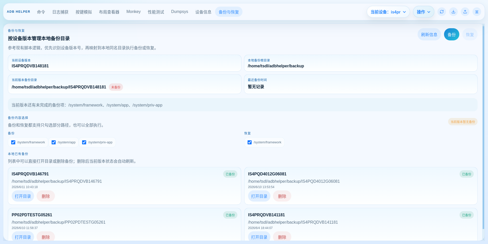

**功能：**

| 操作 | 说明 |
|------|------|
| 创建备份 | 备份指定系统目录（默认 `/system/framework`, `/system/app`, `/system/priv-app`） |
| 恢复备份 | 自动 root + remount + push + sync + reboot |
| 版本化管理 | 基于 `ro.build.display.id` 自动创建版本目录，可切换版本 |
| 迁移备份 | 跨设备迁移备份根目录 |
| 配置持久化 | 备份路径、版本属性可自定义保存 |

**操作流程：**
1. 选择设备 → 自动读取系统版本号
2. 配置备份路径（支持多行文本逐条配置）
3. 点击 **创建备份** → 自动打包关键目录到本地
4. 恢复时选择版本 → 点击 **恢复备份** → 自动执行 root + push + sync + reboot

---

## 结果处理能力

所有命令执行的输出结果都具备以下能力：

| 能力 | 说明 |
|------|------|
| 双视图切换 | 结构化预览 ↔ 原始文本，解析失败也不丢失原文 |
| 关键字搜索高亮 | 全文本搜索，匹配项高亮显示 |
| 历史记录 | 保存最近 500 条执行记录，分页浏览 |
| 差异对比（Diff） | 任意两条记录逐行 diff，支持 token 级差异高亮 |
| 多格式导出 | Markdown / TXT / JSON 三种格式 |

---

