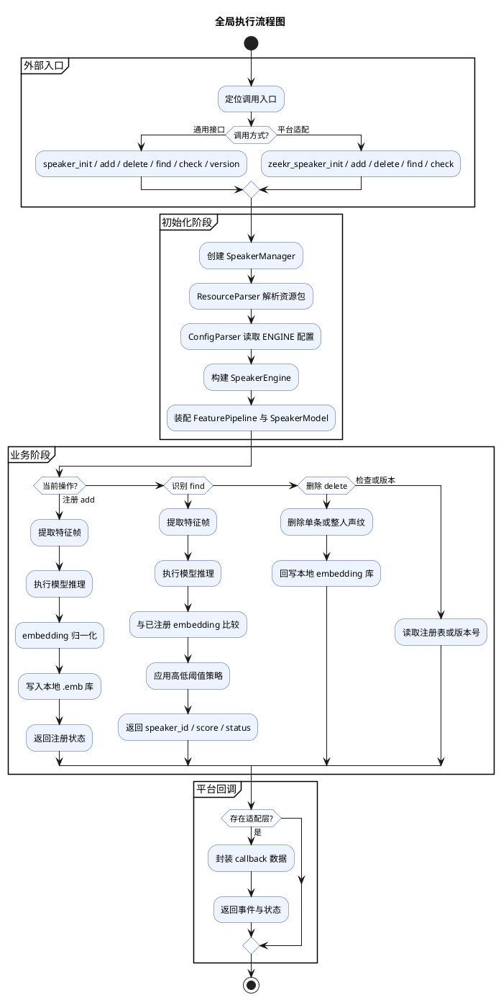
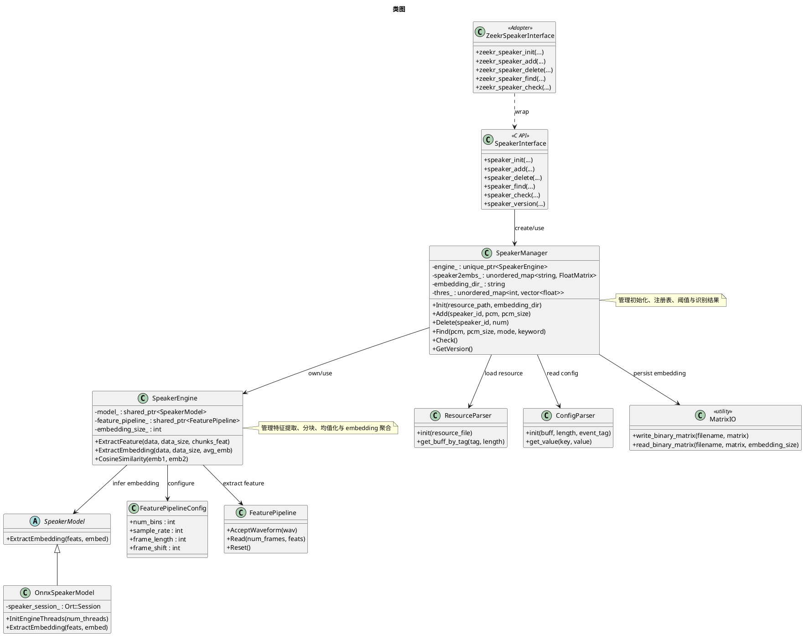

# P1 项目架构 + 全局执行流程

## 使用目标

本模板用于第一阶段输出“项目结构 + 全局执行流程图”。

分析入口固定为：构建系统 + README。

分析范围固定为：源码目录、公开接口、核心模块、第三方依赖、测试目录、构建文件。

忽略范围固定为：所有编译生成目录与中间产物目录，例如 `build/`、`out/`、`dist/`、`cmake-build-*`、`.cache/`。

## 输出清单

输出文件名称固定为：`<工程名-架构说明.md>`。

输出的文件内容必须严格按照输出清单的要求输出，不要自己追加其他内容。

1. 目录结构与功能说明。
2. 全局执行流程图。
3. 类图。
4. 主要技术点归纳与详细说明。

## 1. 目录结构与功能说明

目录结构必须只保留源码、接口、测试、第三方依赖和构建文件，忽略所有编译输出目录。

参考格式如下：

```text
project-root/
├── include/                  # 公开头文件
│   ├── core/                 #   核心模块 API
│   └── net/                  #   网络模块 API
├── src/                      # 实现代码
│   ├── core/                 #   核心模块实现
│   ├── net/                  #   网络模块实现
│   └── main.cpp              #   程序入口
├── third_party/              # 第三方依赖
│   └── json/                 #   JSON 解析库
├── test/                     # 单元测试
├── CMakeLists.txt            # 构建系统入口
└── README.md                 # 项目说明
```

输出要求：

- 先按目录树展示结构，再逐段解释每个目录和关键文件的职责。
- 对目录说明时，要指出它属于接口层、实现层、依赖层、测试层还是构建层。
- 如果存在多个构建入口文件，要明确哪个是顶层入口，哪些是子模块入口。
- 如果目录名无法直接说明职责，要结合 README 和构建文件补充解释。

## 2. 全局执行流程图

全局执行流程要从“构建入口 + README”反推到“主程序入口或对外接口”，然后再连接到核心模块。流程图不能只画几个模块框，必须体现阶段、关键分支、核心处理动作和返回结果。

PlantUML 参考模板如下：



输出要求：

- 节点名称必须替换成项目中的真实模块、真实接口或真实产物，不能保留抽象占位词。
- 必须体现“外部入口 -> 初始化 -> 业务分支 -> 返回结果”的完整链路。
- 至少画出注册、识别、删除/检查三类关键分支，不能只画初始化主线。
- 如果项目不是可执行程序，而是 SDK 或动态库，要把“主程序入口”替换成“对外 API 入口”。
- 如果存在平台适配层、回调层、守护模式、异常返回或资源落盘，必须在图中给出明确位置。
- 如果项目存在多条运行链路，先画主链路，再补充旁路说明，不要把所有细节堆在一张图里。
- 流程图中的所有内容（包括分区、判断节点、动作节点）必须在画布中居中显示，禁止偏左或偏右。- **流程图箭头必须使用正交折线**（先垂直再水平，或先水平再垂直），禁止使用斜线直连。分支与合并处使用"垂直线 → 水平连线 → 分支垂直箭头"的标准折线方式。
- **流程图节点间距**：相邻节点之间的垂直间距不小于 30px，分区（partition）之间的垂直间距不小于 40px，确保视觉上有足够的留白和呼吸感。
- **流程图拆分**：如果流程图过长或者过宽，可以拆分成多张流程图，避免在一张图中塞入过多内容。
- **流程图内容不得超出边框**：流程图的所有内容（节点、箭头、标签、分区标题等）不得超出画布边框或分区边框，必须完整可见。
- **节点文字不得超出节点框**：每个动作节点的文字内容必须完整显示在节点框内部，节点框宽度必须大于最长文字行的宽度。如果文字过长，应换行或使用缩写+图下方说明。
- **节点框不得超出分区框**：所有节点框（包括分支节点）的左右边界不得超出所属分区背景框的左右边界，分区框宽度必须能完整容纳所有内部节点。
## 3. 类图

类图用于表达公开接口、核心调度者、关键实现模块以及数据持久化/配置读取组件之间的静态关系。类图不能只画几个类名，必须体现核心属性、关键方法和职责关系。

PlantUML 参考模板如下：



输出要求：

- 必须覆盖对外接口层、核心管理层、算法执行层、模型抽象层、配置/资源读取层和持久化层。
- 每个核心类都要尽量给出关键属性和关键方法，不能只放类名。
- 如果项目不是典型面向对象结构，可以把类图中的类替换为关键抽象、门面、工厂、控制器或接口实现体。
- 如果项目明显是纯 C 风格，可以把类图替换为“接口结构图”，但仍然使用 PlantUML 表达依赖关系。
- 类图只画核心骨架，不把每个工具类都画进去，但必须把真正决定控制流和数据流的类保留下来。
- 如果存在平台适配层或多后端推理实现，必须通过 stereotype、继承或依赖关系明确体现。
- **类图必须使用直线箭头**，禁止使用折线（polyline / 拐弯）箭头。如果直线箭头会穿过其他类框，必须调整类框位置使箭头不穿透。
- **类框不能互相遮盖**，直线箭头不能穿过任何类框。宁可拆图也不能出现遮盖或穿透。
- **如果单张类图过宽或过长**，必须将类图拆分为多张子图（如"接口与管理层类图""引擎与特征层类图"），每张子图聚焦一个层次或子系统，避免在一张图里塞入过多类框。
- **类图必须按功能子层分组**：当一张类图包含多个不同功能域的类时，必须使用 package 分区（不同背景色矩形 + 层标签）将类按子功能域分组。例如"前端特征提取"和"I/O 与配置"应分别用填色矩形框起来并标注层名称。分区之间保留足够间距（≥40px），避免不同子层的类混在一起无法区分。

## 4. 主要技术点归纳与详细说明

本节只归纳真正影响项目结构、依赖边界、维护方式和执行路径的技术点。技术点完全根据项目代码分析得出，不预设固定类别。

### 技术点提取原则

1. **来源唯一性**：所有技术点必须从项目代码、构建文件和配置文件中提取，不得凭经验预设或套用通用模版。
2. **显著性筛选**：只收录真正影响项目结构、依赖边界、维护方式或执行路径的关键设计决策。
3. **禁止泛化**：以下内容不得作为技术点：开发语言、编译器、运行平台、通用分层模式（除非该项目有独特的分层设计）。

### 输出格式

先输出一张技术点总览表（N 行，列为：# / 技术点 / 规则 / 原因 / 设计意图），然后每个技术点单独展开详细说明段落。

### 详细说明要求

- 每个技术点都要写"规则、原因、设计意图"。
- 如果某个技术点会显著影响理解，可以补充图表，但图表仍需围绕模块关系或流程关系。
- 只写项目级技术点，不写局部编码技巧。
- **每个技术点必须有独立的详细说明段落**，不能仅靠表格一行概括。
- 详细说明必须包含以下内容（缺一不可）：
  1. **具体实现方式**：引用项目中的真实文件、类名、函数名或配置项来说明该技术点是如何落地的。
  2. **数据流或控制流**：描述该技术点涉及的数据如何流转、控制权如何传递，至少给出关键路径。
  3. **代码层面的证据**：给出与该技术点直接相关的代码片段或文件引用（文件名 + 关键行为描述），证明分析结论有据可查。
  4. **影响范围与边界**：说明该技术点影响了哪些模块、哪些构建目标，以及该技术点的边界在哪里（什么场景不适用）。
  5. **潜在风险或改进空间**（可选）：如果在分析中发现该技术点存在明显的设计隐患、扩展瓶颈或与行业最佳实践的偏差，可以简要指出。
- 详细说明的深度标准：读完后，一个不了解项目的工程师应当能回答"这个技术点在代码里怎么实现的？涉及哪些模块？数据怎么流转？"这三个问题。
- 技术点数量不设上限，但每个都必须经过代码验证。

## 最终交付要求

1. 所有结论都要绑定到真实目录、真实 target、真实接口或真实构建文件。
2. 所有图表都要与正文中的模块命名保持一致。
3. 所有说明都优先解释“职责、边界、依赖、意图”，而不是罗列文件名。
4. 如果 README 与构建文件冲突，以构建文件为准，并在文中指出冲突点。

## 自检规则

成果物生成完毕后，必须执行以下自检流程，确保所有分析结论与项目实际代码一致。

### 自检流程

1. **术语与文件名校验**：检查成果物中提到的所有文件名、类名、函数名、配置项、文件后缀名是否在项目中真实存在。禁止凭推测使用未经验证的名称。
   - 例如：如果成果物中写了"解析 .res 资源包"，必须回到代码中确认实际处理的是否真的是 `.res` 文件，还是其他格式。
2. **数据流校验**：成果物中描述的每条数据流（输入 → 处理 → 输出），必须能在代码中找到对应的调用链。
3. **依赖关系校验**：成果物中描述的模块之间依赖关系，必须与 CMakeLists.txt 中的 `target_link_libraries` 一致。
4. **配置参数校验**：成果物中提到的所有配置参数名称，必须与代码中 `get_value()` 或 `load_pairconf_to_vec()` 的实际 key 一致。
5. **阈值与枚举值校验**：成果物中使用的枚举值、错误码数值，必须与头文件定义一致。
6. **类图直线箭头校验**：类图中所有箭头必须为直线，不能出现折线或拐弯。如果存在折线箭头，必须调整类框位置后重新生成。
7. **类图尺寸与拆分校验**：单张类图不能过宽或过长导致阅读困难。如果类框超过 8 个或画布超过 1600×1200，应拆分为多张子图。
8. **类框遮盖与穿透校验**：逐一检查类框是否互相遮盖，直线箭头是否穿过了其他类框。任何遮盖或穿透都必须修正。
9. **流程图居中校验**：流程图的所有内容必须在画布中居中显示，不能偏左或偏右。
10. **流程图折线箭头校验**：流程图中所有连接箭头必须为正交折线（垂直+水平段），不能出现斜线直连。
11. **流程图间距校验**：相邻节点垂直间距不小于 30px，分区之间间距不小于 40px。
12. **类图黑边校验**：检查类图 PNG 四周是否存在黑边（通常由 `img.crop()` 超出画布导致）。裁剪坐标必须使用 `min(value, canvas_size)` 确保不超出。
13. **线穿透 package/类框校验**：检查所有箭头线（尤其是跨层依赖箭头）是否穿过了中间 package 分区背景或类框。跨层箭头必须沿 package 外边缘绕行，不得直接垂直穿越中间区域。标签不得与类框或 package 标签页重叠。
14. **内容质量校验**：检查成果物中是否存在内容过于简单、敷衍的情况（如某个技术点仅有一句话概括、某个模块说明过于笼统缺乏具体证据），发现此类问题必须立即补充完善。
15. **流程图节点超出校验**：检查流程图中每个节点的文字内容是否完整显示在节点框内，节点框是否超出所属分区背景框的边界。任何文字截断或节点溢出分区的情况都必须修正。
16. **类图类框与 package 重叠校验**：检查类框边界是否与 package 分区边框重叠或过于紧贴（间距应 ≥20px），发现重叠或紧贴必须调整位置。

### 自检输出

- 如果自检发现不一致，必须立即修正成果物内容，不能带着错误交付。
- 自检不需要在成果物中体现，仅作为内部质量保障流程。
